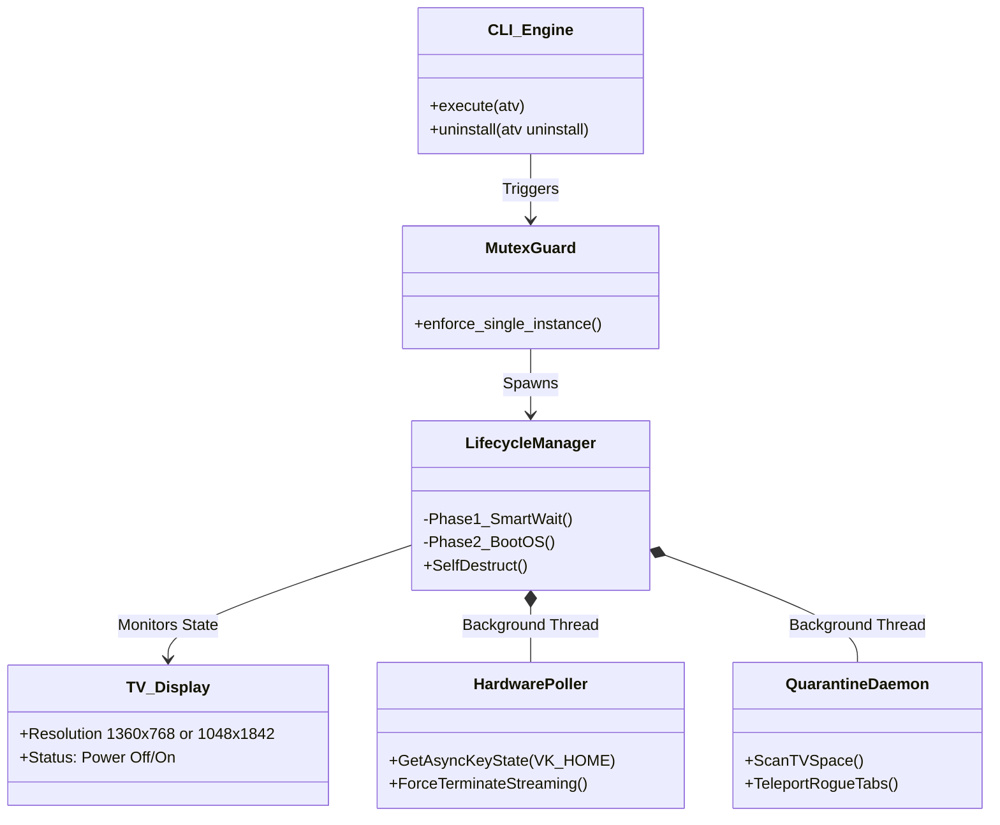

```text
           x
.-. _______|
|=|/     /  \
| |_____|_""_|
|_|_[X]_|____|
```

# Abo7amdanTV OS

Abo7amdanTV OS is a lightweight, zero-latency desktop TV operating system designed for multi-monitor setups. It acts as an autonomous on-demand CLI process that binds to secondary displays, providing a highly responsive web-based streaming hub.

<div align="center">
  
</div>

## Quick Start

Deploying the OS on your Windows machine is as easy as running two commands:

**1. Install the System:**
```bash
setup.bat
```

**2. Launch the OS:**
```bash
atv
```
*(You can now type `atv` from anywhere on your PC!)*

**3. Uninstall the OS:**
```bash
atv uninstall
```

---

## Architecture

The system operates on a state-of-the-art **"On-Demand Self-Destruct"** architecture. It waits silently at 0% CPU for your TV to power on, boots the OS, and completely erases itself from RAM the millisecond you turn the TV off.



---

## Core Features

* **On-Demand Anti-Lag Lifecycle**: Unlike traditional daemon software that drains system resources 24/7, `atv` is a true on-demand process. When launched, it waits silently. The moment you turn the TV off, it calls `os._exit(0)`, completely self-destructing to guarantee **zero lag** when your PC wakes from sleep.
* **Strict Quarantine Teleportation**: Chromium shares IPC processes. To prevent desktop browsing tabs from hijacking the TV screen, the active Teleportation Daemon scans the TV monitor space. Any non-OS window found is instantly teleported back to your primary desktop.
* **Zero-Latency Hardware Poller**: Bypasses the notoriously laggy Python `keyboard` module by using a native Windows `GetAsyncKeyState` polling loop. You can press the `Home` key on your remote to exit Netflix instantly without the OS "swallowing" your normal typing keystrokes.
* **Native Fullscreen & Auto-Destruction**: Injects native Chromium `--start-fullscreen` arguments for a flawless borderless UI, and uses deep memory `SC_CLOSE` signals to forcefully terminate background streaming processes.
* **Single-Instance Mutex Lock**: Deeply integrated native Windows Mutex prevents multiple copies of the `atv` command from running simultaneously, mathematically eliminating redundant polling bottlenecks.

---

## Developer Setup

To modify and recompile the OS from source:

**1. Clone & Install Dependencies**
```bash
git clone https://github.com/t8pr/Abo7amdanTV.git
cd Abo7amdanTV
pip install -r requirements.txt
```

**2. Configure Monitor Output**
The daemon specifically looks for a monitor with standard TV resolutions (`1360x768` or `1048x1842`). If your secondary monitor has a different resolution, modify the `get_tv_display()` function in `main.py` to match your target hardware.

**3. Compile for Production**
Use PyInstaller to compile the source code into a standalone background binary:
```bash
python -m PyInstaller --noconsole --onefile --add-data "templates;templates" --add-data "imgs;imgs" --name atv main.py
```

## Technology Stack
* **Backend Engine**: Python 3 (ctypes, pywin32, sys)
* **Local Server**: Flask
* **Window Manipulation**: Windows User32 API
* **Frontend**: HTML5, CSS3, Vanilla JavaScript
