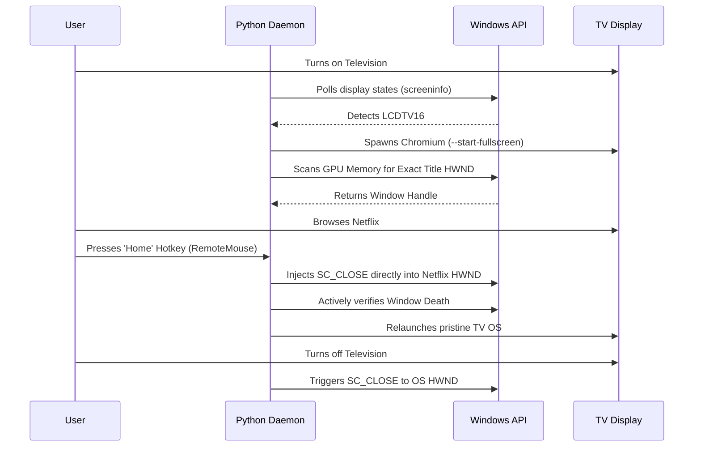

<div align="center">
  
  <br />
  <h1>Abo7amdanTV OS</h1>
  <p><strong>An Enterprise-Grade, Self-Managing Smart TV Operating System for Windows</strong></p>
  
  <p>
    <a href="#overview">Overview</a> •
    <a href="#key-features">Features</a> •
    <a href="#system-architecture">Architecture</a> •
    <a href="#installation-guide">Installation</a> •
    <a href="#customization-for-your-own-tv">Customization</a>
  </p>
</div>

<hr />

## OVERVIEW

Abo7amdanTV OS is a high-performance, fully automated Smart TV environment designed for multi-monitor Windows workstations. Instead of wrestling with standard desktop interfaces, wireless mice, or juggling browser windows on a secondary television display, this project transforms any connected TV into a dedicated, cinematic Smart TV experience.

Engineered to run as a silent, zero-footprint background daemon, the system utilizes direct Windows API calls to monitor hardware states. The exact millisecond you power on your television, the OS dynamically injects a beautiful, high-definition interface tailored specifically to your display coordinates. When the TV is powered off, the daemon surgically terminates the environment, ensuring your primary workspace remains completely untouched.

## KEY FEATURES

- **Autonomous Hardware Detection:** Continuously polls display outputs with zero CPU overhead. Instantly deploys the OS when the designated television is detected, and forcefully cleans up the environment the moment the display is disconnected.
- **Cinematic Frontend:** A fluid, responsive HTML5/CSS3 interface perfectly scaled for exact television resolutions, eliminating scrollbars and visual bleeding.
- **Native Remote Integration:** Engineered to work flawlessly with mobile trackpad applications (such as Remote Mouse). Custom event listeners snap focus to elements, and global hardware interrupts (`Home` / `Esc`) allow users to instantly escape third-party streaming apps (Netflix, Prime) back to the central OS.
- **Absolute Fullscreen Enforcement:** Utilizes Chromium's `--start-fullscreen` arguments combined with memory-level window tracking to guarantee a borderless, immersive experience.
- **Spatial & Memory Window Tracking:** Built with `ctypes`, the Python daemon tracks windows not by guessing, but by actively scanning Windows Memory (HWNDs) for exact title signatures and physical pixel coordinates on the GPU. This prevents catastrophic collisions with the user's primary browsing sessions and natively bypasses IPC routing delays.

## SYSTEM ARCHITECTURE

The project leverages a robust hybrid architecture, bridging low-level system operations with modern web technologies.



### Backend Daemon (Python / Flask)
- **Flask:** Acts as a lightweight, secure loopback server to deliver frontend assets instantaneously.
- **ctypes & screeninfo:** Interfaces directly with the Windows API (`GetWindowText`, `IsWindowVisible`, `PostMessageW`) to perform surgical window management.
- **psutil & pyautogui:** Manages hardware interrupts and simulates raw keyboard telemetry to manipulate third-party application states without explicit API access.

### Frontend (HTML / CSS / JS)
- Modern CSS grid architecture utilizing Google Fonts (Outfit).
- Custom `mouseenter` and `click` listeners that bridge the gap between traditional trackpad inputs and Smart TV remote behaviors.

## INSTALLATION GUIDE

This system is built to run flawlessly on Windows 10/11 machines running Brave/Chromium browsers.

1. **Clone the Repository**
   ```bash
   git clone https://github.com/t8pr/Abo7amdanTV.git
   cd Abo7amdanTV
   ```

2. **Install Dependencies**
   Ensure Python 3.13+ is installed, then install the required modules:
   ```bash
   pip install -r requirements.txt
   ```

3. **Test the Daemon Native**
   Run the application in your terminal to verify display detection:
   ```bash
   python main.py
   ```

4. **Deploy as a Background Service**
   For the ultimate experience, compile the project into a standalone executable using PyInstaller:
   ```bash
   python -m PyInstaller --noconsole --onefile --add-data "templates;templates" --add-data "imgs;imgs" --name Abo7amdanTV_OS main.py
   ```
   Place the resulting `.exe` into your Windows `shell:startup` folder. It will now run invisibly forever.

## CUSTOMIZATION FOR YOUR OWN TV

You can easily adapt Abo7amdanTV OS for your specific television or monitor setup:

### 1. Update the Resolution Logic
In `main.py`, locate the `get_tv_display()` function. Update the hardcoded resolution (e.g., `1360` and `768`) or hardware name to match your specific TV's specifications.
```python
if (m.width == 1920 and m.height == 1080): return m
```

### 2. Modify the Apps
Open `templates/index.html` to add or remove streaming services from the home screen grid. Ensure you add corresponding high-quality thumbnails to the `imgs/` folder.

### 3. Tweak the Frontend Scaling
Open `templates/style.css` and adjust the root `width` and `height` properties to match your exact television resolution to ensure absolute pixel-perfect scaling.

## LICENSE

This project is open-source and available under the MIT License. Feel free to fork, modify, and build your own ultimate home theater setup.
