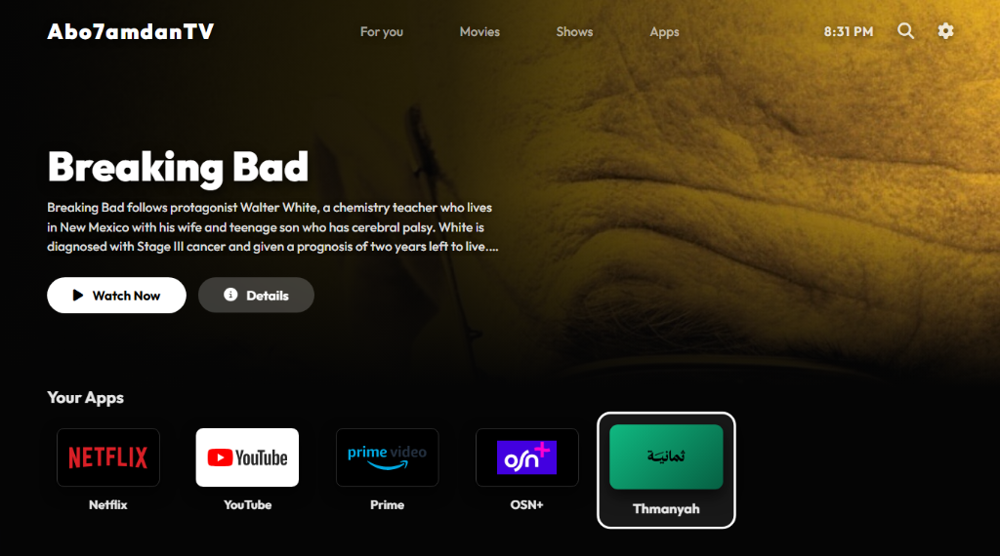
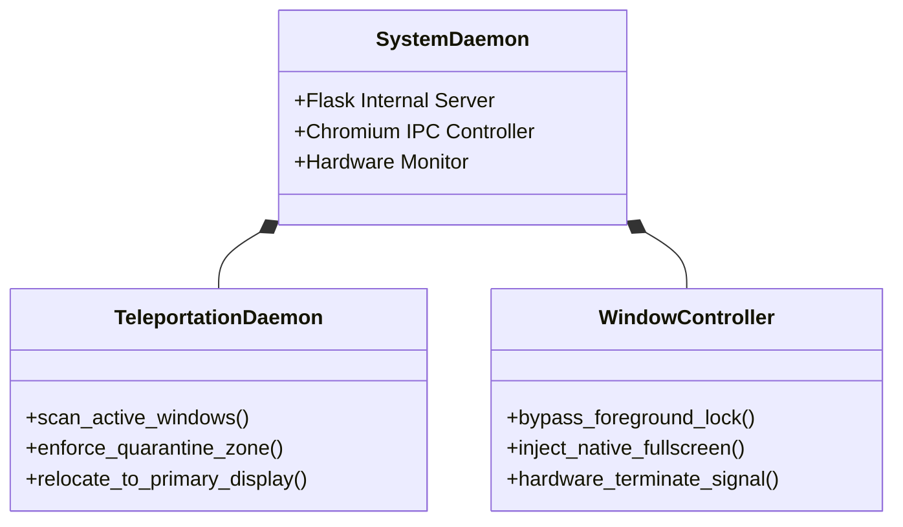

# Abo7amdanTV - An Smart Operating System

<div align="center">
  
</div>

Abo7amdanTV OS is a lightweight, strictly quarantined Smart TV operating system built for multi-monitor Windows environments. It transforms a secondary monitor (such as an non-smart TV) into an isolated, fully automated entertainment hub without interfering with primary desktop productivity.

## Architecture

The system operates as a background Windows daemon that actively monitors hardware states and manages Chromium IPC routing to enforce strict monitor quarantine.



## Core Features

* **Strict Quarantine Teleportation**: Chromium shares IPC processes across windows. To prevent desktop browsing tabs from accidentally spawning on the TV screen, the Teleportation Daemon actively scans the TV monitor space every 1.5 seconds. Any non-OS browsing window found in the quarantine zone is instantly teleported back to the primary desktop display.
* **Native Fullscreen Injection**: Bypasses Windows `ForegroundLockTimeout` limits to hijack thread input and aggressively inject native Chromium `--start-fullscreen` arguments, guaranteeing a flawless, borderless TV experience on fresh boots.
* **Hardware-Level Termination**: Overrides traditional Alt+F4 closures which can be intercepted by streaming platforms. The OS uses direct `SC_CLOSE` memory signals combined with `Ctrl+W` fallback macros to guarantee background audio processes are fully terminated when navigating home.
* **Automated Display Lifecycle**: The daemon binds to the Windows display API. When the TV is powered on, the OS boots instantly. When the TV is powered off, the OS terminates its web processes to conserve system resources.

## Installation & Setup

If you wish to deploy this TV OS on your own multi-monitor Windows setup:

1. **Clone the Repository**
   ```bash
   git clone https://github.com/t8pr/Abo7amdanTV.git
   cd Abo7amdanTV
   ```

2. **Install Dependencies**
   Ensure Python 3.8+ is installed, then run:
   ```bash
   pip install -r requirements.txt
   ```

3. **Configure Monitor Output**
   The daemon specifically looks for a monitor with a width of `1360` pixels (standard 768p non-smart TV). If your secondary monitor has a different resolution, modify the `get_tv_display()` function in `main.py` to match your target hardware.

4. **Compile for Production**
   Use PyInstaller to compile the source code into a standalone background daemon:
   ```bash
   python -m PyInstaller --noconsole --onefile --add-data "templates;templates" --add-data "imgs;imgs" --name Abo7amdanTV_OS main.py
   ```

5. **Deploy to Startup**
   Move the resulting `Abo7amdanTV_OS.exe` from the `dist/` directory into your Windows Startup folder:
   ```text
   %APPDATA%\Microsoft\Windows\Start Menu\Programs\Startup
   ```
   The OS will now autonomously manage your secondary display in the background on every system boot.

## Technology Stack

* **Backend Engine**: Python 3 (ctypes, pywin32)
* **Local Server**: Flask
* **Window Manipulation**: Windows User32 API
* **Frontend**: HTML5, CSS3, Vanilla JavaScript
