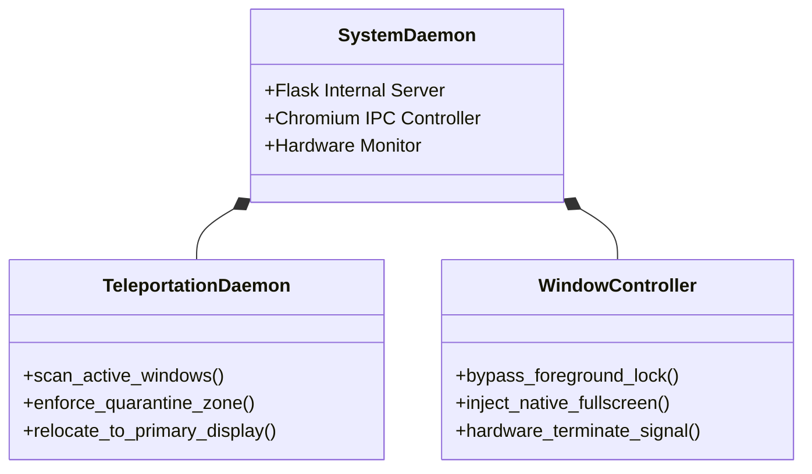

# Abo7amdanTV - An Smart Operating System

<div align="center">
  
</div>

Abo7amdanTV OS is a lightweight, strictly quarantined Smart TV operating system built for multi-monitor Windows environments. It transforms a secondary monitor (such as an non-smart TV) into an isolated, fully automated entertainment hub without interfering with primary desktop productivity.

## Architecture

The system operates as a background Windows daemon that actively monitors hardware states and manages Chromium IPC routing to enforce strict monitor quarantine.



## Core Features

* **On-Demand Anti-Lag Architecture**: Unlike traditional daemon software that runs 24/7 and drains system resources, Abo7amdanTV OS is designed as a true "On-Demand" background CLI process. When you run the `atv` command, it waits silently using 0% CPU for the TV to power on. The absolute millisecond you turn the TV off, the software completely self-destructs (`os._exit(0)`), clearing itself from memory. This guarantees **zero** UI lag when your primary monitors wake from sleep mode.
* **Strict Quarantine Teleportation**: Chromium shares IPC processes across windows. To prevent desktop browsing tabs from accidentally spawning on the TV screen, the active Teleportation Daemon scans the TV monitor space. Any non-OS browsing window found in the quarantine zone is instantly teleported back to the primary desktop display.
* **Zero-Latency Hardware Poller**: Bypasses the notoriously laggy Python `keyboard` module by using a native Windows `GetAsyncKeyState` polling loop. You can press the `Home` key on your remote to exit Netflix instantly without the OS "swallowing" your keystrokes while you code in VSCode.
* **Native Fullscreen & Auto-Destruction**: Injects native Chromium `--start-fullscreen` arguments for a borderless UI, and uses deep memory `SC_CLOSE` signals coupled with `keybd_event` macros to forcefully terminate background streaming processes.
* **Single-Instance Mutex Lock**: Deeply integrated native Windows Mutex prevents multiple copies of the `atv` command from running simultaneously, mathematically eliminating redundant polling bottlenecks.

## Installation & Setup

If you wish to deploy this TV OS on your own multi-monitor Windows setup:

1. **Clone the Repository**
   ```bash
   git clone https://github.com/t8pr/Abo7amdanTV.git
   cd Abo7amdanTV
   ```

2. **Install Dependencies**
   Ensure Python 3.8+ is installed, then run:
   ```bash
   pip install -r requirements.txt
   ```

3. **Configure Monitor Output**
   The daemon specifically looks for a monitor with a width of `1360` pixels (standard 768p non-smart TV). If your secondary monitor has a different resolution, modify the `get_tv_display()` function in `main.py` to match your target hardware.

4. **Compile for Production**
   Use PyInstaller to compile the source code into a standalone background daemon:
   ```bash
   python -m PyInstaller --noconsole --onefile --add-data "templates;templates" --add-data "imgs;imgs" --name atv main.py
   ```

5. **Install CLI Command**
   Run the included `setup.bat` file. This will automatically inject the `atv` command into your Windows PATH. 
   Once installed, you can launch the TV OS anytime by simply pressing `Win + R` and typing `atv`, or by typing `atv` in any Command Prompt window. The OS will autonomously run in the background and gracefully self-terminate the moment the TV is turned off.
   *(To remove the command later, simply run `atv uninstall` in your terminal)*

## Technology Stack

* **Backend Engine**: Python 3 (ctypes, pywin32)
* **Local Server**: Flask
* **Window Manipulation**: Windows User32 API
* **Frontend**: HTML5, CSS3, Vanilla JavaScript
